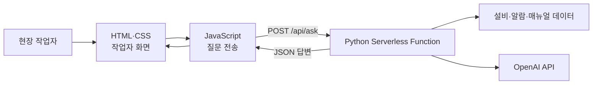

`ai-factory-helper`는 **제조 현장 작업자가 설비 알람, 작업표준, 품질 문제 등을 질문하면 AI가 관련 자료를 검색해 답변하는 웹 프로그램**으로 구성할 수 있습니다.



## 1. 전체 프로그램 구조

```text
ai-factory-helper/
├── index.html
├── css/
│   └── style.css
├── js/
│   └── app.js
├── api/
│   ├── ask.py
│   ├── equipment.py
│   ├── alarm.py
│   └── health.py
├── data/
│   ├── equipment_master.json
│   ├── alarm_master.json
│   └── sop_data.json
├── requirements.txt
├── vercel.json
├── .gitignore
└── README.md
```

|구분|파일|주요 역할|
|---|---|---|
|프론트엔드|`index.html`|작업자가 사용하는 화면 구성|
|프론트엔드|`css/style.css`|화면 색상, 배치, 글자 크기 설정|
|프론트엔드|`js/app.js`|질문 전송, 응답 수신, 결과 표시|
|백엔드|`api/ask.py`|AI 질문 분석 및 답변 생성|
|백엔드|`api/equipment.py`|설비 정보 조회|
|백엔드|`api/alarm.py`|알람 원인 및 조치 방법 조회|
|백엔드|`api/health.py`|서버의 정상 작동 여부 확인|
|데이터|`data/*.json`|설비·알람·SOP 기준정보|
|설정|`requirements.txt`|Python 패키지 지정|
|설정|`vercel.json`|Vercel 배포 및 API 경로 설정|

---

# 2. 프론트엔드 프로그램 역할

## 2.1 `index.html` — 작업자 화면 구성

HTML은 화면의 구조를 만듭니다.

`ai-factory-helper`에서는 다음과 같은 화면을 구성할 수 있습니다.

- 설비 선택
    
- 현재 알람번호 입력
    
- 작업자 질문 입력
    
- 질문 전송 버튼
    
- AI 답변 표시
    
- 안전 주의사항 표시
    
- 참고한 SOP·매뉴얼 표시
    

### 적용 예

```html
<!DOCTYPE html>
<html lang="ko">
<head>
  <meta charset="UTF-8">
  <meta name="viewport" content="width=device-width, initial-scale=1.0">

  <title>AI Factory Helper</title>
  <link rel="stylesheet" href="/css/style.css">
</head>
<body>
  <main class="container">
    <h1>AI Factory Helper</h1>
    <p>제조 현장 작업자 지원 시스템</p>

    <label for="equipment-id">설비 선택</label>
    <select id="equipment-id">
      <option value="CNC-05">CNC-05</option>
      <option value="CNC-06">CNC-06</option>
    </select>

    <label for="question">질문</label>
    <textarea
      id="question"
      placeholder="예: CNC-05에서 알람 2045가 발생했습니다. 어떻게 조치합니까?"
    ></textarea>

    <button id="ask-button">AI에게 질문하기</button>

    <p id="status"></p>

    <section id="answer-area" class="answer-card">
      <h2>AI 답변</h2>
      <div id="answer"></div>
    </section>
  </main>

  <script src="/js/app.js"></script>
</body>
</html>
```

HTML 자체는 AI 답변을 만들거나 설비 데이터를 조회하지 않습니다. 작업자가 입력하고 결과를 확인할 수 있는 **화면의 뼈대**만 담당합니다.

---

## 2.2 `style.css` — 현장 화면 디자인

CSS는 작업자가 현장에서 화면을 쉽게 읽고 조작하도록 디자인합니다.

### 적용 예

```css
body {
  margin: 0;
  background-color: #eef2f6;
  font-family: Arial, sans-serif;
}

.container {
  max-width: 800px;
  margin: 30px auto;
  padding: 30px;
  background-color: white;
  border-radius: 12px;
}

select,
textarea,
button {
  box-sizing: border-box;
  width: 100%;
  margin: 8px 0 20px;
  padding: 14px;
  font-size: 18px;
}

textarea {
  min-height: 130px;
}

button {
  color: white;
  background-color: #1565c0;
  border: none;
  border-radius: 8px;
  cursor: pointer;
}

button:disabled {
  background-color: #94a3b8;
  cursor: not-allowed;
}

.answer-card {
  padding: 20px;
  border-left: 6px solid #1565c0;
  background-color: #f8fafc;
}
```

### AI Factory Helper에서 CSS가 담당하는 부분

- 작업자가 장갑을 착용해도 누르기 쉬운 큰 버튼
    
- 공장 현장에서 읽기 쉬운 큰 글자
    
- 정상·주의·위험 상태별 색상 구분
    
- 스마트폰·태블릿·PC 화면 대응
    
- 답변과 안전 경고의 시각적 구분
    

CSS는 외부 API를 호출하거나 설비 정보를 처리하지 않습니다.

---

## 2.3 `app.js` — 사용자 동작 및 백엔드 호출

JavaScript는 작업자가 입력한 질문을 Python 백엔드로 보내고 받은 답변을 화면에 표시합니다.

### 적용 예

```javascript
const askButton = document.getElementById("ask-button");
const statusElement = document.getElementById("status");
const answerElement = document.getElementById("answer");

askButton.addEventListener("click", async () => {
  const equipmentId =
    document.getElementById("equipment-id").value;

  const question =
    document.getElementById("question").value.trim();

  if (!question) {
    alert("질문을 입력해주세요.");
    return;
  }

  askButton.disabled = true;
  statusElement.textContent = "관련 자료를 검색하고 있습니다.";
  answerElement.textContent = "";

  try {
    const response = await fetch("/api/ask", {
      method: "POST",
      headers: {
        "Content-Type": "application/json"
      },
      body: JSON.stringify({
        equipment_id: equipmentId,
        question: question
      })
    });

    const data = await response.json();

    if (!response.ok) {
      throw new Error(data.error || "요청 처리에 실패했습니다.");
    }

    answerElement.innerHTML = `
      <h3>${data.equipment_id}</h3>
      <p><strong>판단 결과:</strong> ${data.summary}</p>
      <p><strong>조치 방법:</strong> ${data.action}</p>
      <p><strong>주의사항:</strong> ${data.safety_notice}</p>
      <p><strong>근거 자료:</strong> ${data.source}</p>
    `;

    statusElement.textContent = "답변이 완료되었습니다.";
  } catch (error) {
    statusElement.textContent = "오류가 발생했습니다.";
    answerElement.textContent = error.message;
  } finally {
    askButton.disabled = false;
  }
});
```

### JavaScript의 처리 순서

1. 작업자가 선택한 설비번호를 읽습니다.
    
2. 질문 내용을 확인합니다.
    
3. `/api/ask`로 POST 요청을 보냅니다.
    
4. 처리 중이라는 메시지를 표시합니다.
    
5. Python 백엔드로부터 JSON 응답을 받습니다.
    
6. 답변, 조치 방법, 안전사항, 출처를 화면에 표시합니다.
    
7. 오류가 발생하면 오류 메시지를 표시합니다.
    

---

# 3. 백엔드 프로그램 역할

백엔드는 Vercel의 `api/` 폴더에 Python 파일로 구성합니다. `api/` 폴더의 각 Python 파일이 하나의 API 주소가 됩니다.

|Python 파일|호출 주소|역할|
|---|---|---|
|`api/ask.py`|`/api/ask`|작업자 질문에 대한 종합 답변|
|`api/equipment.py`|`/api/equipment`|설비 기본정보 조회|
|`api/alarm.py`|`/api/alarm`|알람 원인과 조치 방법 조회|
|`api/health.py`|`/api/health`|서버 상태 확인|

## 3.1 `api/ask.py` — AI 질의응답 처리

이 파일은 AI Factory Helper의 중심 백엔드입니다.

### 주요 역할

- 프론트엔드에서 전송한 JSON 읽기
    
- 설비번호와 질문 검증
    
- 설비 Master 조회
    
- Alarm Master 조회
    
- SOP·매뉴얼 검색
    
- OpenAI API 호출
    
- 답변을 JSON으로 반환
    
- 오류 및 예외 처리
    

### 단순 적용 예

```python
import json
import os
from http.server import BaseHTTPRequestHandler


EQUIPMENT_MASTER = {
    "CNC-05": {
        "name": "CNC 선반 5호기",
        "manufacturer": "DN Solutions",
        "controller": "FANUC i Plus"
    }
}

ALARM_MASTER = {
    "2045": {
        "name": "척 클램프 상태 이상",
        "cause": "척 클램프 신호 또는 압력 상태를 확인해야 합니다.",
        "action": (
            "설비를 정지하고 척 클램프 상태, "
            "유압 압력 및 센서 신호를 확인합니다."
        ),
        "safety_notice": (
            "설비 내부 확인 전 비상정지 및 "
            "에너지 차단 절차를 준수하십시오."
        ),
        "source": "CNC-05 알람 대응 SOP"
    }
}


class handler(BaseHTTPRequestHandler):
    def send_json(self, status_code, data):
        response_body = json.dumps(
            data,
            ensure_ascii=False
        ).encode("utf-8")

        self.send_response(status_code)
        self.send_header(
            "Content-Type",
            "application/json; charset=utf-8"
        )
        self.send_header(
            "Content-Length",
            str(len(response_body))
        )
        self.end_headers()
        self.wfile.write(response_body)

    def do_POST(self):
        try:
            content_length = int(
                self.headers.get("Content-Length", 0)
            )

            body = self.rfile.read(content_length)
            request_data = json.loads(body or b"{}")

            equipment_id = request_data.get("equipment_id")
            question = request_data.get("question", "").strip()

            if not equipment_id or not question:
                self.send_json(400, {
                    "error": "설비번호와 질문이 필요합니다."
                })
                return

            equipment = EQUIPMENT_MASTER.get(equipment_id)

            if not equipment:
                self.send_json(404, {
                    "error": "등록되지 않은 설비입니다."
                })
                return

            # 실제 프로그램에서는 질문에서 알람번호를 추출하거나
            # Alarm Master 및 매뉴얼 검색을 수행합니다.
            alarm = ALARM_MASTER.get("2045")

            result = {
                "equipment_id": equipment_id,
                "equipment_name": equipment["name"],
                "controller": equipment["controller"],
                "summary": alarm["cause"],
                "action": alarm["action"],
                "safety_notice": alarm["safety_notice"],
                "source": alarm["source"]
            }

            self.send_json(200, result)

        except json.JSONDecodeError:
            self.send_json(400, {
                "error": "올바른 JSON 형식이 아닙니다."
            })

        except Exception:
            self.send_json(500, {
                "error": "서버 처리 중 오류가 발생했습니다."
            })
```

이 예시는 설명을 위해 데이터를 코드에 간단히 넣은 형태입니다. 실제 프로그램에서는 설비 Master, Alarm Master, SOP 데이터베이스 또는 검색 시스템과 연결하는 것이 좋습니다.

---

## 3.2 `api/equipment.py` — 설비정보 조회

설비번호를 기준으로 설비의 기본정보를 반환합니다.

### 조회정보 예

- 설비번호: `CNC-05`
    
- 설비명: CNC 선반 5호기
    
- 제조사
    
- 모델
    
- 제어기
    
- 설치일자
    
- 가동상태
    
- 최근 정비일자
    

### 요청 예

```text
GET /api/equipment?id=CNC-05
```

### 응답 예

```json
{
  "equipment_id": "CNC-05",
  "equipment_name": "CNC 선반 5호기",
  "manufacturer": "DN Solutions",
  "controller": "FANUC i Plus",
  "installation_date": "2025-09",
  "status": "alarm"
}
```

---

## 3.3 `api/alarm.py` — 알람정보 조회

설비번호와 알람번호를 받아 원인과 표준조치 방법을 제공합니다.

### 요청 예

```text
GET /api/alarm?equipment_id=CNC-05&alarm_code=2045
```

### 응답 예

```json
{
  "equipment_id": "CNC-05",
  "alarm_code": "2045",
  "alarm_name": "척 클램프 상태 이상",
  "possible_causes": [
    "척 클램프 미완료",
    "유압 압력 부족",
    "클램프 센서 신호 이상"
  ],
  "actions": [
    "설비를 안전하게 정지한다.",
    "척 클램프 상태를 확인한다.",
    "유압 압력을 확인한다.",
    "센서 신호를 확인한다.",
    "이상이 지속되면 보전팀에 연락한다."
  ],
  "source": "CNC-05 알람 대응 SOP"
}
```

알람번호처럼 정확한 코드가 있는 데이터는 AI가 임의로 답을 만들게 하기보다, 먼저 Alarm Master에서 정확히 조회한 후 AI가 작업자에게 이해하기 쉽게 설명하도록 구성하는 것이 안전합니다.

---

# 4. AI Factory Helper 적용 시나리오

## 적용 사례 1: CNC 알람 조치 지원

### 작업자 질문

```text
CNC-05에서 알람 2045가 발생했습니다.
어떻게 조치해야 합니까?
```

### 프론트엔드 처리

`app.js`가 다음 데이터를 백엔드로 전송합니다.

```json
{
  "equipment_id": "CNC-05",
  "question": "알람 2045가 발생했습니다. 어떻게 조치해야 합니까?"
}
```

### 백엔드 처리

1. `CNC-05` 설비 Master를 조회합니다.
    
2. 질문에서 알람번호 `2045`를 확인합니다.
    
3. Alarm Master에서 알람 원인과 조치 방법을 조회합니다.
    
4. 관련 SOP와 과거 Trouble 사례를 검색합니다.
    
5. 검색된 근거를 바탕으로 AI 답변을 생성합니다.
    
6. 답변과 근거 자료를 JSON으로 반환합니다.
    

### 화면 출력 예

```text
설비: CNC-05
제어기: FANUC i Plus
알람: 2045

판단 결과
척 클램프 완료 신호가 확인되지 않은 상태입니다.

권장 조치
1. 설비를 안전하게 정지합니다.
2. 척 클램프 상태를 확인합니다.
3. 유압 압력이 기준 범위인지 확인합니다.
4. 클램프 센서와 배선 상태를 확인합니다.
5. 알람이 계속되면 보전팀에 연락합니다.

안전 주의
설비 내부를 확인하기 전에 비상정지와 에너지 차단
절차를 준수해야 합니다.

근거
CNC-05 알람 대응 SOP / Alarm Master 2045
```

---

## 적용 사례 2: 작업표준 조회

### 작업자 질문

```text
FLG-150-4 제품을 CNC-05에서 가공할 때
사용하는 공구와 작업순서를 알려줘.
```

### 백엔드에서 조회할 데이터

- 제품 Master
    
- 공정 Routing
    
- CNC 프로그램번호
    
- Tool Master
    
- 작업표준서
    
- 품질검사 기준서
    
- 도면 버전
    

### 응답 예

```json
{
  "product_code": "FLG-150-4",
  "equipment_id": "CNC-05",
  "nc_program": "O1504",
  "tools": [
    {
      "tool_no": "T0101",
      "purpose": "외경 황삭"
    },
    {
      "tool_no": "T0202",
      "purpose": "외경 정삭"
    },
    {
      "tool_no": "T0303",
      "purpose": "내경 가공"
    }
  ],
  "inspection_items": [
    "외경",
    "내경",
    "두께",
    "표면조도"
  ],
  "source": "FLG-150-4 작업표준서 Rev.03"
}
```

공구번호와 가공조건은 실제 승인된 Tool Master와 작업표준서를 기준으로 제공해야 합니다. AI가 도면이나 기준정보 없이 공구를 임의로 선정하도록 하면 안 됩니다.

---

## 적용 사례 3: 품질불량 원인 확인

### 작업자 질문

```text
FLG-150-4 제품의 내경 치수가 반복적으로 크게 측정됩니다.
무엇을 확인해야 합니까?
```

### 백엔드 처리 대상

- 최근 측정값
    
- 공구 사용횟수
    
- 공구 보정값
    
- 주축 부하
    
- 설비 알람 이력
    
- 동일 불량 Trouble 이력
    
- 검사 기준값
    

### 답변 예

```text
우선 확인 항목

1. 내경 가공 공구의 마모 및 파손 여부
2. Tool Offset 입력값
3. 공구 교체 후 보정 여부
4. 소재 고정 및 척 클램프 상태
5. 최근 동일 불량 발생 이력
6. 측정기 영점과 교정 상태

현재 데이터만으로 원인을 확정할 수 없습니다.
Tool Offset, 공구 사용횟수 및 최근 측정값을 추가로 확인하십시오.
```

---

# 5. 프론트엔드와 백엔드의 역할 구분

|비교 항목|프론트엔드|백엔드|
|---|---|---|
|사용 기술|HTML/CSS/JavaScript|Python|
|실행 위치|작업자의 브라우저|Vercel 서버|
|주요 사용자|현장 작업자|프론트엔드 및 외부 시스템|
|주요 역할|입력, 조회, 화면 표시|데이터 검색, 검증, AI 처리|
|설비 선택|화면에 목록 표시|설비 Master 제공|
|알람 질문|질문을 서버로 전송|Alarm Master 및 SOP 검색|
|AI 답변|결과를 보기 좋게 표시|OpenAI API로 답변 생성|
|API 키|저장 금지|환경변수로 관리|
|오류 처리|사용자에게 오류 안내|오류 원인과 상태코드 반환|
|보안 데이터|직접 보관하지 않음|접근권한에 따라 처리|

## 핵심 정리

- `index.html`은 **작업자가 보는 화면의 구조**를 만듭니다.
    
- `style.css`는 **현장 사용에 적합한 디자인**을 담당합니다.
    
- `app.js`는 **작업자 질문을 Python API로 보내고 답변을 표시**합니다.
    
- `api/ask.py`는 **질문을 분석하고 설비·알람·SOP 데이터를 검색해 AI 답변을 생성**합니다.
    
- `api/equipment.py`와 `api/alarm.py`는 **설비와 알람의 정확한 기준정보를 제공**합니다.
    
- OpenAI API 키와 데이터베이스 접속정보는 프론트엔드가 아닌 **Vercel 환경변수**로 관리해야 합니다.
    

즉, `ai-factory-helper`에서 프론트엔드는 **현장 작업자용 창구**, 백엔드는 **제조 데이터와 AI를 연결하는 처리 엔진**의 역할을 합니다.