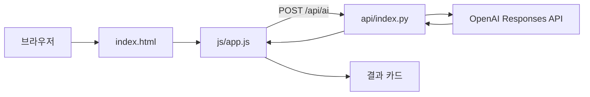

# AI Factory Helper

제조현장 작업자가 설비 문제를 입력하면 AI가 문제 상황, 예상 원인, 우선 확인 사항,
권장 조치 방법과 주의사항을 정리하는 PoC 웹 서비스입니다.

**제출 링크**

- 배포 URL: `배포 후 Vercel Domains에서 확인한 실제 URL을 여기에 입력`
- GitHub: [bigpark61/ai-factory-helper](https://github.com/bigpark61/ai-factory-helper)
- 증빙: 배포 후 `docs/screenshots/desktop.png`, `mobile.png`, `ai-result.png`를 추가하고 아래 표에 기기와 해상도를 기록합니다.

## 주요 기능

- HTML/CSS/JavaScript 프론트엔드에서 FastAPI Serverless API 호출
- 빈 값, 2,000자 초과 입력, 400/422/429/5xx, 네트워크 오류와 30초 지연 안내
- 일시적 장애에 대한 최대 2회 지수 backoff 재시도와 수동 `다시 시도` 버튼
- `success: true` 및 비어 있지 않은 `result` 응답 구조 검증
- PC와 모바일을 지원하는 반응형 화면 및 `aria-busy`/상태 알림

## 파일별 책임

| 파일 | 책임 |
| --- | --- |
| `index.html` | 입력 폼, 결과 영역, 접근성 상태와 화면 구조 |
| `css/style.css` | 데스크톱/모바일 레이아웃, 로딩/성공/실패 시각 상태 |
| `js/app.js` | 입력 검증, fetch, 타임아웃, 재시도, 응답 검증, 결과 렌더링 |
| `api/index.py` | FastAPI 라우팅, Pydantic 요청/응답 모델, OpenAI 호출 |

## 기술 구조



## 시작하기

Python 3.12 이상에서 실행합니다.

```powershell
py -3.12 -m venv .venv
.\.venv\Scripts\Activate.ps1
python -m pip install -r requirements.txt
$env:OPENAI_API_KEY = "본인의_API_KEY"
$env:OPENAI_MODEL = "gpt-5-mini"
python -m uvicorn api.index:app --reload
```

브라우저에서 `http://127.0.0.1:8000`을 열고, FastAPI 문서는 `http://127.0.0.1:8000/docs`에서 확인합니다.
프로젝트 루트의 `.env.local`도 자동으로 읽지만, API 키는 코드나 Git에 저장하지 않습니다. `.env`, `.env.*`, `.venv`는 `.gitignore`로 제외합니다. 키가 로그나 채팅에 노출되면 즉시 폐기하고 새 키로 교체하세요.

## 배포 및 운영

1. Vercel 프로젝트의 Settings > Environment Variables에 `OPENAI_API_KEY`를 Production/Preview별로 등록합니다. `OPENAI_MODEL`은 선택 사항입니다.
2. Deployments에서 최신 배포의 Build Logs와 Function Logs를 확인합니다.
3. 브라우저 개발자 도구 Console/Network에서 `/api/health`, `/api/ai` 상태 코드와 응답 JSON을 확인합니다.
4. 환경변수가 없거나 오래된 경우 값을 다시 저장한 뒤 Redeploy합니다. 키는 노출이 의심되면 즉시 폐기하고 새 키를 발급합니다.
5. 운영 키는 최소 권한으로 분리하고, 담당자 변경·노출 사고·정기 점검 시 회전합니다. 키를 커밋하지 않습니다.

배포 URL을 확인하려면 Vercel 프로젝트의 Settings > Domains에서 기본 도메인을 복사해 위 제출 링크에 기록합니다.

## API 계약

`POST /api/ai`의 `symptom`은 필수입니다. `equipmentName`/`equipmentType`은 100자,
`alarmCode`는 50자, `symptom`/`context`는 각각 2,000자까지 허용합니다.

```json
{
	"equipmentName": "CNC-05",
	"equipmentType": "CNC 선반",
	"alarmCode": "2045",
	"symptom": "Tool 교환 직후 설비가 정지했습니다.",
	"context": "가공 중 Tool 교환 직후 발생"
}
```

정상 응답은 Pydantic `AnalysisResponse`로 검증됩니다.

```json
{
	"success": true,
	"result": "1. 문제 상황 요약\n2. 예상 원인\n3. 우선 확인 사항\n4. 권장 조치 방법\n5. 주의사항"
}
```

프롬프트는 제조사 매뉴얼과 안전절차를 우선하도록 하며, 실제 출력은 위 다섯 항목을 따릅니다.

## 검증 시나리오 및 증빙

| 시나리오 | 기대 결과 | 증빙 |
| --- | --- | --- |
| 정상 입력 | 다섯 항목 결과 표시 | `docs/screenshots/ai-result.png` |
| 증상 빈 값 | 입력 포커스와 안내 표시 | 브라우저 화면 |
| 증상 2,001자 | 서버 422와 입력 수정 안내 | Network 응답 |
| 500/429/네트워크 오류 | 상태별 안내와 재시도 버튼 | 브라우저 화면 |
| 30초 초과 | 지연 안내와 재시도 | 브라우저 화면 |
| 모바일 390x844 | 폼과 결과가 가로로 넘치지 않음 | `docs/screenshots/mobile.png` |
| 데스크톱 1440x900 | 전체 메뉴/폼/결과 확인 | `docs/screenshots/desktop.png` |

스크린샷 제출 전 표의 실제 캡처 파일과 테스트 기기·해상도를 함께 기록합니다.

## 응답 지연 개선 계획

- 현재: 프론트 30초 timeout, 일시적 실패 최대 2회 backoff, `OPENAI_MODEL` 환경변수로 모델 교체 가능
- 단기: 기본 모델의 출력 토큰을 줄이고 결과를 다섯 항목 요약으로 제한
- 중기: 동일한 정규화 입력에 짧은 TTL 캐시를 적용하되 설비 정보와 사용자 입력의 민감정보 보존 여부를 먼저 검토
- 확장: 요청 ID·지연시간·토큰 사용량을 비밀값 없이 기록하고, 품질 저하가 없는 경량 모델을 부하 테스트로 선정

## 확장 및 보안 대응 로드맵

RAG, Vector DB, MES/PLC 연계는 현재 범위에서 제외했습니다. 도입 시 데이터 분류, 접근권한,
감사 로그, 장애 격리와 프레임워크 영향 평가를 먼저 수행합니다. API 키 유출 시에는
즉시 Vercel 환경변수에서 제거하고 키를 폐기·재발급한 뒤 로그와 Git 이력을 점검하고,
영향 범위에 따라 배포를 재실행합니다.

## 안전 주의사항

AI 결과는 참고용입니다. 실제 작업에서는 설비 제조사 매뉴얼, 작업표준서, 안전절차와
사업장 규정을 우선 적용하세요. 전기 작업, 설비 내부 작업, 안전장치 해제 또는 인터록
우회는 권한을 가진 담당자와 정해진 절차에 따라 수행해야 합니다.
